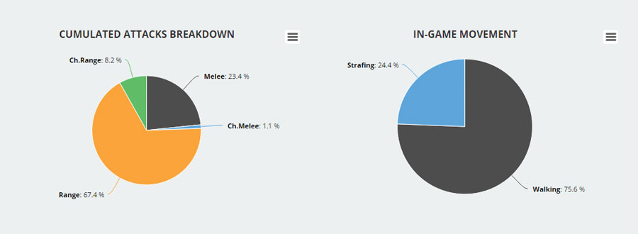
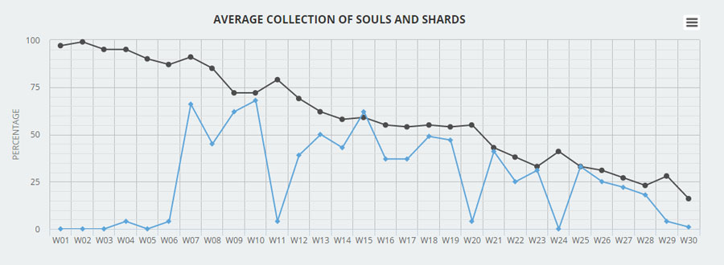
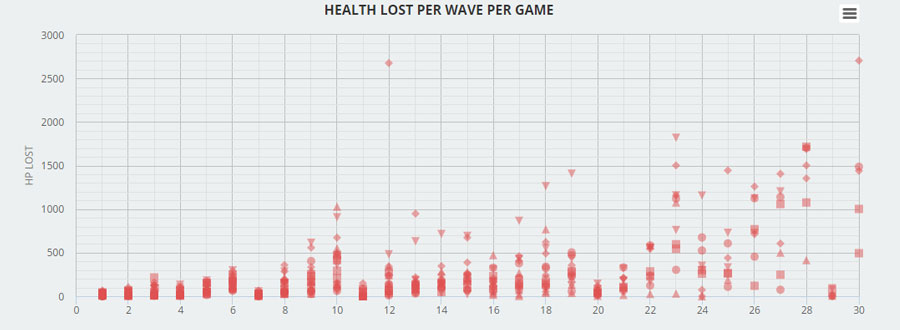

### About

The PDV is a data viz tool that I build for the [Curse of Mermos](http://www.indiedb.com/games/curse-of-mermos1) project. It takes as input JSON files generated by the game, does some processing and then and uses HighCharts to display various data.

Less time filling in spreadsheets, more time iterating.


Here's an example object of data generated by the game:

```
{
    "id":"3bmgu06nsq6#1",
    "waveNo":[1,2,3,4,5,6,7,8],
    "soulsDrop":[20,36,70,62,125,183,44,122],
    "soulsCol":[20,36,67,58,112,169,44,122],
    "shardsDrop":[0,0,0,0,0,0,0,1],
    "shardsCol":[0,0,0,0,0,0,0,0],
    "healthLost":[39,60,186,67,281,383,12,126],
    "potionsUsed":[1,0,1,0,1,3,2,3],
    "revives":[0,0,1,0,1,1,0,0],
    "upgrades":[["None"],["None"],["None"],["T1AGI","T1VIT"],["T1DEX"],["T1STR"],["None"],["None"]],
    "potionsBought":[0,1,1,0,0,2,3,2],
    "glyphBought":[["None"],["None"],["None"],["None"],["None"],["None"],["None"],["None"]],
    "melee":[43,58,130,39,51,80,7,21],
    "meleeCh":[0,0,0,0,0,0,0,0],
    "range":[1,9,58,60,124,164,30,88],
    "rangeCh":[0,0,0,0,0,0,0,0],
    "strafeTime":[1,0,9,3,13,34,8,10],
    "elapsedTime":[22,38,111,60,152,179,100,15]
}
```

A demo instance of the project is still online, you can see it [here](https://www.planet34.org/box/prj/pdv/).


### Screens






### License
Playtest Data Visualizer is licensed under an  MIT license.